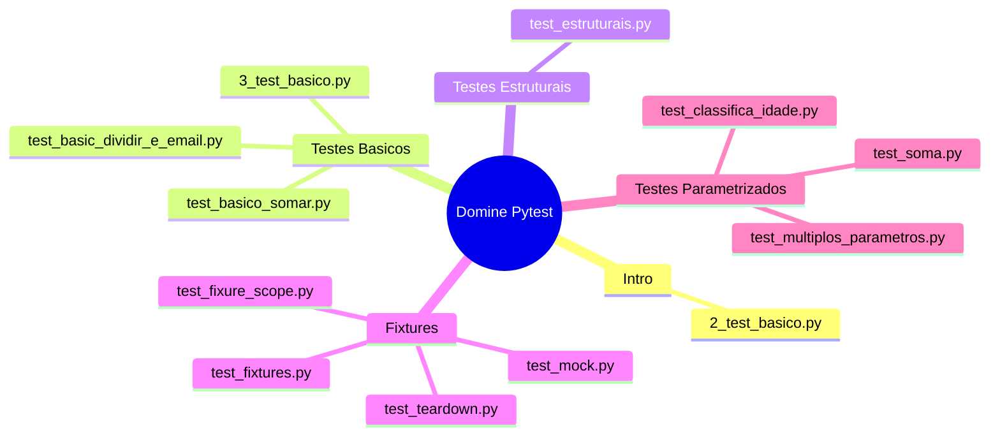

# Domine Pytest: Testes de Software com Python (2024)

Este projeto é um guia prático para dominar o Pytest, a principal ferramenta de testes para Python. Aqui você encontrará exemplos de testes básicos, estruturais, uso de fixtures, parametrização, mocks e integração com banco de dados, organizados por capítulos para facilitar o estudo.

---

## Estrutura do Projeto



## Como Executar os Testes

1. **Instale as dependências:**

```bash
pip install -r requirements.txt
```

## Execute todos os testes com cobertura:

```python
pytest -v -q --cov=. --cov-report=term .
```

## Conteúdo por Capítulo

## Intro

- 2_test_basico.py: Teste simples de soma usando assert.

## Testes_basicos

### Funções:

- main.py: Funções utilitárias (validação de email, divisão, soma, comprimento de lista, verificação de número positivo).
- 3_test_basico.py: Testa se um número é positivo.

### Testes:

- test_basic_dividir_e_email.py: Testa validação de email e divisão segura.
- test_basico_somar.py: Testa soma e comprimento de lista.
  
## Testes Estruturais

- test_estruturais.py: Testa igualdade de listas.
  
## Fixtures

- test_fixtures.py: Uso básico de fixture para listas.
- test_fixure_scope.py: Exemplos de escopos de fixture (function, module, session).
- test_mock.py: Mock de resposta HTTP usando unittest.mock.
- test_teardown.py: Fixture para conexão com banco de dados SQLite em memória.

## Testes Parametrizados

### Funções:

- classifica_idade.py: Função para classificar idade.
- soma.py: Função de soma.
- multiplos_parametros.py: Função para calcular total com desconto e imposto.

### Testes:

- test_classifica_idade.py: Teste parametrizado para classificação de idade.
- test_multiplos_parametros.py: Teste parametrizado com múltiplos parâmetros.
- test_soma.py: Teste parametrizado da função soma.

## Configuração

- pytest.ini em todas as pastas:

```bash
[pytest]
pythonpath = app
```

- requirements.txt:

```python
pytest 
pytest-cov 
mock 
flake8 
mypy 
isort 
mkdocs-material 
interrogate 
invoke 
termcolor 
sqlalchemy
```

## Execução do Pytest

```python
pytest -v -q --cov=. --cov-report=term .
```

## Observações

- Todos os exemplos são didáticos e focados em cobrir os principais recursos do Pytest.
- O projeto pode ser expandido para incluir testes de integração, testes assíncronos, plugins do Pytest, etc.

## Autor

- Igor Szot
